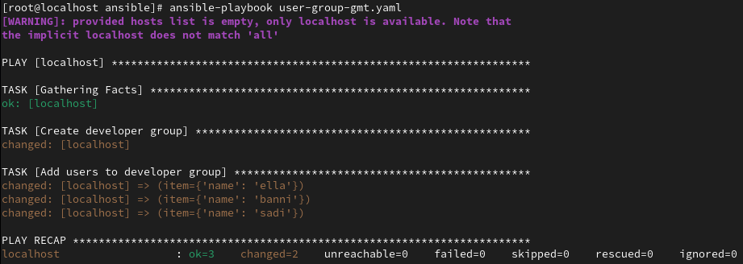

# ansible-simple-security

## Overview

A growing collection of ansible playbooks that perform security and administrative tasks. 

### 1. [SSH hardening and Admin User Setup](ssh-hardening-admin-user.yaml)

This playbook creates a new admin user and assigns it an SSH key. It also disbales root login for SSH.

The variables `admin_user`, `groups` and `ssh_key_path` can be configured in the command line when running the playbook. This allows for admin type users to be configured more easily, with accordance to individual user name, groups and SSH key. The SSH key should be generated before running this playbook, so you have the path of the key handy.

Also, it confirms that the root login is disabled for SSH. 

Playbook running with default values:

Playbook running with variables defined in the command line:

### 2. [Unauthorized Logins](user-group-mgmt.yaml)

This playbook gets and lists failed logins for local and SSH. It searches in the */var/log/secure* log file to find these events and prints them. 

Also, it returns an error if the */var/log/secure* does not exist, which can happen when there are issues with `rsyslog` or if the playbook is executed on a linux distribution that uses a different log file path for authentication purposes. 

### 3. [User and Group Management](./groups_and_users/) 

This playbook creates a group and adds users to it. The first iteration of this adds users that are defined directly in the playbook. 

The [second iteration](./groups_and_users/dynamic/) performs the same function as the first, but it is more dynamic. It references a separate file that contains the users that need to be added to the group. This file is mentioned when running the playbook in the command line. 

